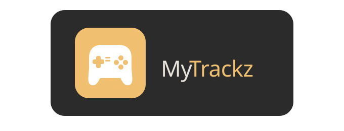
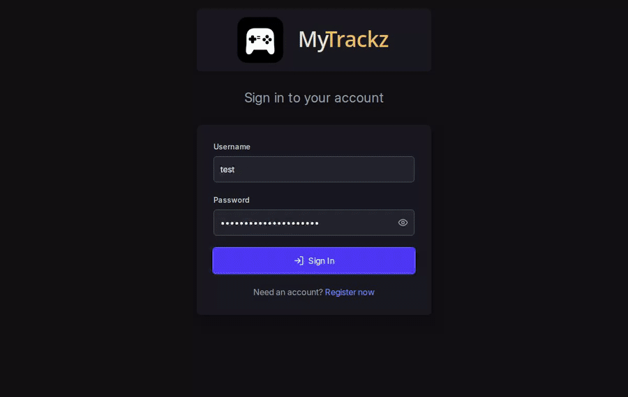
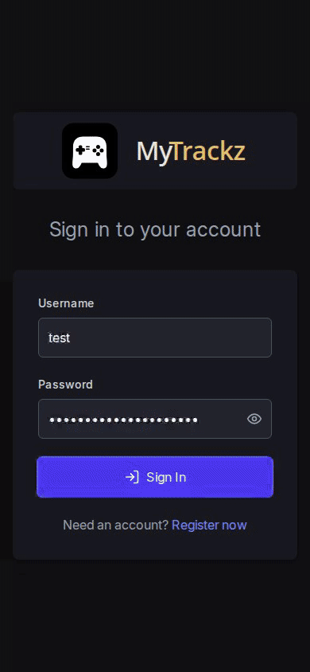
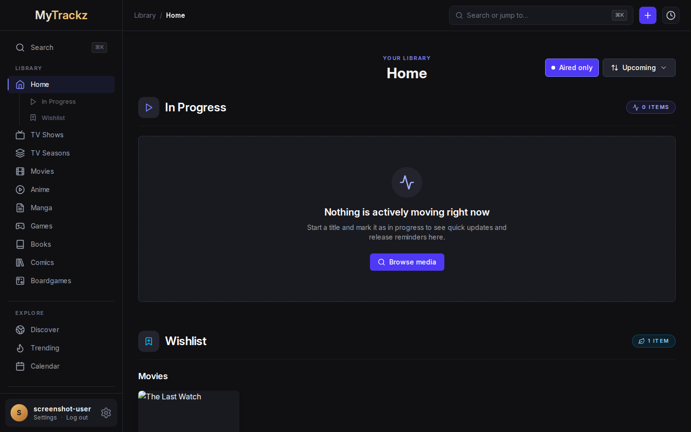
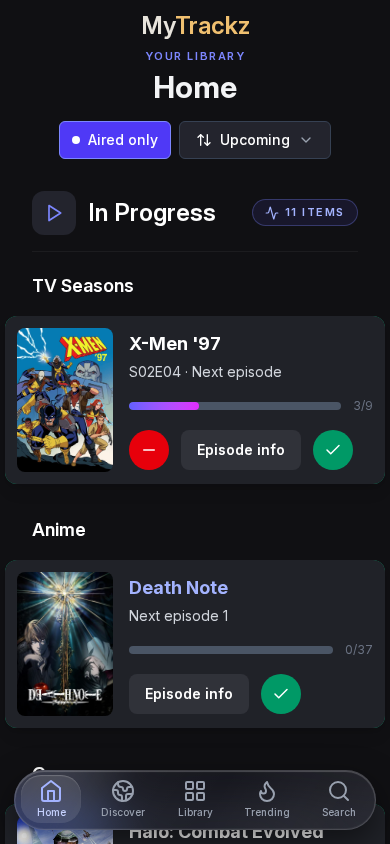

<p align="center">
  
</p>

<!-- --8<-- [start:docs-index-intro] -->

<p align="center">
  <strong>Your watchlist, bookshelf, backlog, and play history—together.</strong>
</p>

<p align="center">
  <a href="LICENSE"></a>
  <a href="https://github.com/FuzzyGrim/Yamtrack"></a>
</p>

MyTrackz is a self-hosted media tracker for movies, TV shows, anime, manga, video games, books, comics, and board games. Built on [Yamtrack](https://github.com/FuzzyGrim/Yamtrack), this fork is tailored for people who want a more adaptable interface, richer discovery, and greater control over their library.

<!-- --8<-- [end:docs-index-intro] -->

<p align="center">
  <a href="#why-mytrackz">Why MyTrackz?</a> ·
  <a href="#screenshots">Screenshots</a> ·
  <a href="#features">Features</a> ·
  <a href="#quick-start">Install</a> ·
  <a href="#documentation">Documentation</a>
</p>

<a id="why-mytrackz"></a>

## Why choose MyTrackz over Yamtrack?

MyTrackz keeps Yamtrack's excellent tracking foundation and adds a more opinionated experience for people who want richer discovery, greater visual control, and a highly adaptable home screen.

<div class="mytrackz-feature-comparison">
  <div>
    <strong>🎨 A more adaptable interface</strong>
    <p>Choose grid or compact home layouts, reorder media rows, expand them automatically, use quick card actions, and navigate from a redesigned mobile interface.</p>
  </div>
  <div>
    <strong>🛠️ Greater library control</strong>
    <p>Cache artwork locally, set custom posters and profile images, filter by genre or game launcher, and fine-tune tracking and display preferences.</p>
  </div>
  <div>
    <strong>🧭 More ways to discover</strong>
    <p>Explore personalized recommendations, current trends, and direct story continuations from a responsive, mobile-friendly interface without resurfacing media you already track.</p>
  </div>
</div>

If you prefer the upstream project's release path and do not need these ⭐ additions, [Yamtrack](https://github.com/FuzzyGrim/Yamtrack) remains an excellent choice. MyTrackz is for users who specifically want the fork's expanded interface and discovery features.

<a id="screenshots"></a>

## 📱 Screenshots

### Feature walkthroughs ⭐

| Desktop home | Mobile home |
| :-----------: | :---------: |
|  |  |

### Interface highlights

| List dashboard | Mobile navigation |
| :------------: | :---------------: |
|  |  |

| Discover recommendations ⭐ | Trending media ⭐ |
| :--------------------------: | :--------------: |
|  |  |

<a id="documentation"></a>

## 📚 Documentation

MyTrackz shares its foundation with Yamtrack, so the [upstream documentation](https://fuzzygrim.github.io/Yamtrack/) remains useful for common features. For this fork, start with the local guides:

- [Environment variables](docs/env-variables.md) — API keys, authentication, storage, and runtime settings
- [Administration](docs/administration.md) — maintenance and operational tasks
- [Media imports](docs/media-imports.md) — supported services and import behavior
- [Social authentication](docs/social-auth.md) — OAuth and identity-provider setup
- [Development](docs/development.md) — local setup, testing, and contribution workflow

> [!IMPORTANT]
> Use the Docker instructions below when installing MyTrackz. Upstream installation guides reference Yamtrack images and do not include this fork's changes.

<!-- --8<-- [start:docs-index-body] -->

<a id="features"></a>

## ✨ Features

Features marked with ⭐ are additions specific to MyTrackz.

### Track your media

- **Eight media types** — movies, TV shows, anime, manga, video games, books, comics, and board games.
- **Detailed progress** — record status, score, progress, repeats, start and finish dates, and personal notes.
- **Episode and season tracking** — follow TV seasons individually and mark episodes as watched.
- **Complete history** — keep a timeline of additions, progress updates, completions, rewatches, and rereads.
- **Custom entries** — add niche or personal media that is missing from supported metadata providers.
- **Personal and collaborative lists** — organize media for any purpose and invite other members to contribute.
- **Release calendar** — browse upcoming releases and subscribe from another calendar app with a personal iCalendar URL.
- **Statistics dashboard** — explore an activity heatmap, status and score distributions, media-type breakdowns, and tracking history.

### Connect and automate

- **Media-server sync** — automatically track playback from [Jellyfin](https://jellyfin.org/), [Plex](https://plex.tv/), and [Emby](https://emby.media/), including metadata-poor Plex DVR episodes and safe title-based TV matching.
- **Library imports** — import from [Trakt](https://trakt.tv/), [Simkl](https://simkl.com/), [MyAnimeList](https://myanimelist.net/), [AniList](https://anilist.co/), [Kitsu](https://kitsu.app/), IMDb, Goodreads, HowLongToBeat, and Steam, with optional scheduled imports.
- **Portable data** — export your tracked media to CSV and import it again later.
- **Release notifications** — send alerts through [Apprise](https://github.com/caronc/apprise) to Discord, Telegram, ntfy, Slack, email, and many other services. Choose individual alerts or a daily digest and exclude items as needed.
- **Streaming availability** — find regional movie and TV streaming providers through JustWatch/TMDB data.
- **Flexible authentication** — support OIDC and more than 100 social providers through [django-allauth](https://allauth.org/).
- **Metadata controls** — refresh a tracked item's title, artwork, episode list, and other provider data with one click.
- **Regional preferences** — configure date and time formats, the first day of the week, streaming region, and quick watch-date behavior independently.
- **Calendar maintenance** — switch between grid and list views, refresh release dates manually, and reconcile newly announced TV seasons and episodes.
- **Granular integrations** — regenerate webhook and calendar tokens, choose which Jellyfin events are processed, and restrict Plex tracking by username.
- **Docker deployment** — run with Redis and either SQLite or PostgreSQL through Docker Compose.

### MyTrackz additions ⭐

- 🖼️ **Local image caching** — download provider artwork as locally served WebP files, enforce a configurable size cap, and purge the cache from Settings → Advanced.
- 🖌️ **Custom poster images** — replace any poster with an image URL and restore the provider artwork with one click.
- 🎮 **Per-game launcher tracking** — assign games to Steam, GOG, Epic, EA, Ubisoft, Blizzard, Xbox, Nintendo, PlayStation, Emulation, Rockstar, Amazon, or Other. Launcher badges appear on cards, lists, home views, and detail pages.
- 🎯 **Game launcher filtering** — narrow the games library by launcher without losing the active search, status, genre, format, sort, pagination, or layout.
- 🎨 **Redesigned interface** — use a liquid-glass mobile navigation bar, updated media grid, morphing library panel, and one-tap movie completion control.
- 🏠 **Compact home layout** — switch from poster grids to a swipeable list with episode details and one-tap progress controls.
- 🧭 **Discover** — get personalized recommendations ranked and interleaved across the media types you currently track or have completed.
- 🔥 **Trending** — browse popular media from TMDB, MyAnimeList, IGDB, and BGG while hiding items already in your library.
- 🔎 **Command palette** — press <kbd>⌘K</kbd> or <kbd>/</kbd> anywhere to search within a media type and jump directly to a result.
- ↕️ **Custom home order** — drag rows or use arrow controls to choose the order of media types on the home page and sidebar.
- 📡 **Aired-only filtering** — hide caught-up episodic shows until the next episode airs; the home row refreshes when a new episode becomes available or you catch up.
- 🏷️ **Genre filtering** — filter libraries with genre data collected automatically from media providers.
- 🛠️ **Grouped preferences** — organize appearance, tracking, recommendations, regional formats, and library navigation settings, including your choice of Wishlist or Backlog terminology.
- 📲 **Improved PWA support** — install more reliably on Android and retain a useful offline fallback page.
- 🔢 **Live library counts** — see matching item totals update while searching, filtering, or changing layouts.
- 🏡 **Expanded home rows** — load every item automatically or retain the compact “Load all” control for larger libraries.
- 🎨 **Colored progress controls** — optionally give grid decrease and increase actions distinct red and green backgrounds.
- 📚 **Continue the Story** — surface sequels, next volumes, expansions, and remasters related to recently completed or in-progress media.
- 🖱️ **Interactive media cards** — lift cards on hover and reveal quick actions for completion, lists, and history directly on the poster.
- 👤 **Profile images** — set an avatar from an image URL with a drag-and-zoom cropper and local caching.
- 🧹 **Cache management** — inspect image and search-cache usage, then clear either cache with a confirmation step from Settings → Advanced.

<a id="quick-start"></a>

## 🐳 Quick start with Docker

### Prerequisites

- Docker with the Compose plugin
- Git

### 1. Clone the fork

```bash
git clone https://github.com/RichardFelix/MyTrackz.git
cd mytrackz
```

### 2. Configure the service

Open `docker-compose.yml` and replace the example `SECRET` with a long, random value. Review `TZ` and any provider API keys you want to use. If MyTrackz will run behind a reverse proxy, set `URLS` to its public origin.

See [Environment variables](docs/env-variables.md) for every available setting.

### 3. Build and start

```bash
docker compose up -d --build
```

MyTrackz will be available at [http://localhost:8000](http://localhost:8000). The default Compose stack stores its SQLite database in `./db`, media files in `./media`, and Redis data in a named Docker volume.

### PostgreSQL

SQLite is a good default for most personal installations. To use PostgreSQL, start from `docker-compose.postgres.yml` and replace the upstream image on the `yamtrack` service:

```yaml
services:
  yamtrack:
    build: .
    image: yamtrack:local
```

Then update the example database credentials and start that stack:

```bash
docker compose -f docker-compose.postgres.yml up -d --build
```

## 💻 Development

See the [development guide](docs/development.md) for the local toolchain and workflow.

## 🙏 Credits

MyTrackz is built on [Yamtrack](https://github.com/FuzzyGrim/Yamtrack) by [FuzzyGrim](https://github.com/FuzzyGrim). Most of the core tracking functionality and codebase comes from that project—please consider giving it a star. If you do not need the ⭐ features above, upstream Yamtrack may be the better fit.

The fork-specific features marked ⭐ were designed and implemented with [Claude Code](https://claude.com/claude-code) and [Codex](https://openai.com/codex/).

MyTrackz is distributed under the [GNU Affero General Public License v3.0](LICENSE).

<!-- --8<-- [end:docs-index-body] -->
